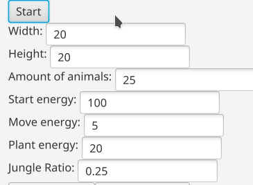
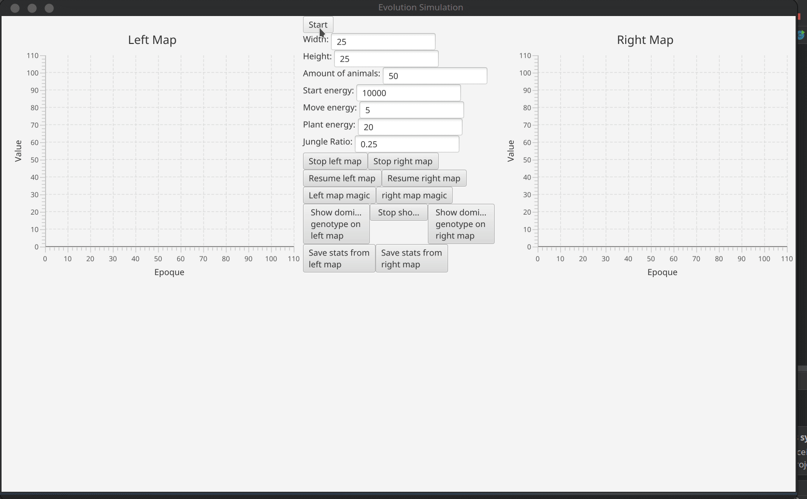

# Evolution simulation

## Brief
Project created during Object Oriented Programming course - main theme of this project is to simulate life of animals on 2 maps.
Their life consists of eating grass, moving on a map and giving life to their children.
As a curious observers we can spy on their energy levels, life length, genes and a few more aspects of their lives.

More information can be found here: https://github.com/apohllo/obiektowe-lab/blob/master/proj1/Readme.md

## Description

1. There are two maps: bounded and unbounded on which animals and plants are spawned.
2. The maps are of identical size and structure, they contain desert and jungle fields. The former is a rectangular-shaped island placed in the centre of the map. There is a higher plant concentration in the jungle.
3. Animals are described by their direction (e.g. S, SW, N etc.), genotype (32 digits from 0 to 7 which correspond with chances that an animal will change its direction) and energy level.
4. Animals change their direction according to their genoype (e.g. the more genes of type 0, the higher the chance is that the animal will move forward).
5. Animals can eat plants on fields they are currently occupying (when there are multiple animals on one field, the strongest animal eats the plant)
6. Animals can breed their offspring, spreading their genes, if there are two of them on a single field and both have enough energy.
7. Animals can be tracked after clicking on them (we can see their life length, number of children and total number of descendants)
8. We can see dominant genotype on both maps.
9. Every epoque new plants grow on the map.
10. There are plots showing statistics which can be saved to CSV files.
11. We can pause and resume simulations on maps independently.
12. We can run the simulation in 'magic mode', which means that when there are 5 animals on the map, 5 more (who are identical copies of them but with full energy) randomly appear on the map. This thing can happend three times and we are notified right ahead.

After executing World.java, we are asked to specify starting parameters of the simulation:

  

Example simulation:

  

Appearance was not the main goal, I was caring about functionality only.
